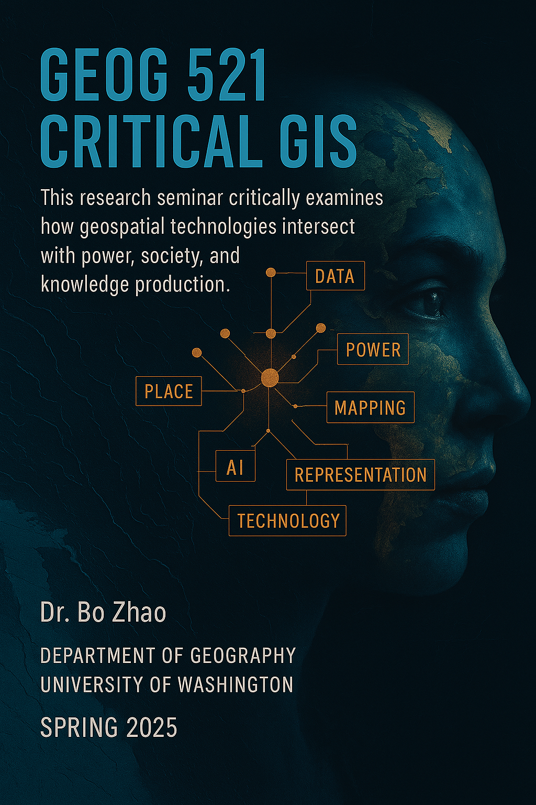

# GEOG521 Research Seminar: Critical GIS

- **Instructor:** Bo Zhao, zhaobo@uw.edu
- **Meetings:**  Mondays 2:30 to 5:20 PM at SMI 409
- **Office Hour**: By appointment or request a zoom meeting via https://t.ly/kpj_t

  This research seminar explores Critical GIS, a field that interrogates the social, political, and epistemological dimensions of geospatial technologies. Through theoretical debates and hands-on projects, students will examine how GIS functions both as a tool of control and as a medium for resistance, empowerment, and social justice. Topics include participatory mapping, counter-cartography, surveillance, digital inequality, and the politics of spatial data. The course also introduces emerging tools such as GeoAI, machine learning for spatial analysis, and geospatial storytelling.

Students will engage in mixed-methods research, integrating qualitative and quantitative approaches to critically assess how GIS is used across domains such as urban planning, environmental justice, digital activism, and spatial humanities. By the end of the seminar, students will gain both critical perspectives and technical skills, understanding GIS not just as software, but as a contested space of knowledge production.

Open to graduate students and advanced undergraduates from diverse disciplines—including geography, data science, urban planning, China studies, environmental studies, and digital humanities. No prior technical experience is required; support will be provided throughout the course.

## :calendar: Weekly Schedule

- Visit the reading material of each week from [**a shared folder at UW Google Drive**](https://drive.google.com/drive/folders/1cj2rCIjkm1tr1antD30uJoM7Yp6WTKum).
- Read all the papers of the week prior to the weekly meetings.

### Week 1: Preparation

Each student is required to prepare a short **statement of intent** describing your final writing project. Each student is highly encouraged to plan this writing project to advance progress their own work, such as qualifying exam essay, draft of journal article, side project, etc. Please send the statement of intent to the instructor via Email zhaobo@uw.edu by **`04/04`**. In the meantime, the instructor will revise the syllabus according to the interests of the participants.

### Week 2: Foundation

  
<b>Readings</b>

1. Sheppard, E. (1995). GIS and society: Towards a research agenda. *Cartography and Geographic Information Systems*, *22*(1), 5–16.  

2. Schuurman, N. (2000). Trouble in the heartland: GIS and its critics in the 1990s. *Progress in Human Geography*, *24*(4), 569–590. 

3. Elwood, S. (2022). Toward a fourth generation critical GIS: Extraordinary politics. *ACME: An International Journal for Critical Geographies*, *21*(4), 436–447.

4. Font-Casaseca, N., & Rodó-Zárate, M. (2024). From the margins of Geographical Information Systems: Limitations, challenges, and proposals. Progress in Human Geography, 48(4), 421-436.

5. Bergmann, L., & Morrill, R. (2017). William Wheeler Bunge: Radical geographer (1928–2013). Annals of the American Association of Geographers, 108(1), 291-300.

### Week 3: Methods and Practices

  
<b>Readings</b>

1. Elwood, S. (2009). Mixed methods: Thinking, doing, and asking in multiple ways. In D. DeLyser, M. Crang, L. McDowell, S. Aitken, & S. Herbert (Eds.), *The handbook of qualitative research in human geography* (pp. xx–xx). Sage Publications.

2. Sui, D., & DeLyser, D. (2011). Crossing the qualitative/quantitative chasm I: Hybrid geographies, the spatial turn, and volunteered geographic information (VGI). *Progress in Human Geography*. Advance online publication.
   
3. Tate, W., & Hogrebe, M. (2011). From visuals to vision: Using GIS to inform civic dialogue about African American males. *Race Ethnicity and Education*, *14*(1), 51–71.

4. Knowles, A. K., Westerveld, L., & Strom, L. (2015). Inductive visualization: A humanistic alternative to GIS. *GeoHumanities*, *1*(2), 233–265.

5. Zhao, B. (2022). Humanistic GIS: Towards a research agenda. *Annals of the American Association of Geographers*. Advance online publication.

### Week 4: System

**Hosts:** *TBD*

**Practical Exercise 1:** [Cloud-based project management using GitHub](02_cyber)

  
<b>Readings</b>

1. Wang, S. (2010). A CyberGIS framework for the synthesis of cyberinfrastructure, GIS, and spatial analysis. *Annals of the Association of American Geographers*, *100*(3), 535–557.

2. Wenwen Li, Michael Batty & Michael F. Goodchild 2019. Realtime GIS for smart cities, *International Journal of Geographical Information Science*, 34(2), 311-324.

3. Zhao, B., & Huang, X. (2020). Encrypted monument: The birth of crypto place on the blockchain. *Geoforum*, *116*, 149–152.

4. Batty, M. (2018). Digital twins. *Environment and Planning B: Urban Analytics and City Science*, *45*(5), 817–820.

5.  Kitchin, R., 2014. The real-time city? Big data and smart urbanism. *GeoJournal*, 79(1), pp.1-14.

6. Mahmoudi, D., Thatcher, J., Imaoka, L. B., & O'Sullivan, D. (2024). From FOSS to profit: Digital spatial technologies and the mode of production. Digital Geography and Society, 7, 100101.

### Week 5: Bot

**Hosts:** *TBD*

**Practical Exercise 2:** [Data collection using web crawler](03_bot)

  
<b>Readings</b>

1. Li, W., Wang, S., & Bhatia, V. (2016). PolarHub: A large-scale web crawling engine for OGC service discovery in cyberinfrastructure. *Computers, Environment and Urban Systems*, *59*, 195–207.

2. Thelwall, M., & Stuart, D. (2006). Web crawling ethics revisited: Cost, privacy, and denial of service. *Journal of the American Society for Information Science and Technology*, *57*(13), 1771–1779. 

3. Winner, L. (1986). Do artifacts have politics? In *The whale and the reactor: A search for limits in an age of high technology* (pp. 19–39). University of Chicago Press.

4. Peng, L., & Zhao, B. (2024). Navigating the ethical landscape behind ChatGPT. *Big Data & Society*, *11*(1), 20539517241237488.

5. He, L., Páez, A., & Liu, D. (2017). Built environment and violent crime: An environmental audit approach using Google Street View. Computers, Environment and Urban Systems, 66, 83-95.

### Week 6: Data

**Hosts:** *TBD*

**Practical Exercise 3:** [Spatial database management using SpatiaLite](04_data)

  
<b>Readings</b>

1. Kwan, M. P. (2012). The uncertain geographic context problem. *Annals of the Association of American Geographers*, *102*(5), 958–968.

2. Wilson, M. W. (2011). ‘Training the eye’: Formation of the geocoding subject. *Social & Cultural Geography*, *12*(4), 357–376.
   
3. Bennett, M. M., Chen, J. K., Alvarez Leon, L. F., & Gleason, C. J. (2022). The politics of pixels: A review and agenda for critical remote sensing. Progress in Human Geography, 46(3), 729-752.

4. Zhang, S., & Zhao, B. (2021). Stand with #StandingRock: Envisioning an epistemological shift in understanding geospatial big data in the “post-truth” era. *Annals of the American Association of Geographers*, *111*(4), 1025–1045.

5. Warf, B. (2025). Post‐Truth GIS. Transactions in GIS, 29(1), e13275.

### Week 7: Mapping

**Hosts:** *TBD*

**Practical Exercise 4:** [Creating A Participatory Mapping Project](05_viz)

  
<b>Readings</b>

1. Crampton, J., & Krygier, J. (2005). An introduction to critical cartography. *ACME: An International Journal for Critical Geographies*, *4*(1), 11–33.

2. Dunn, C. (2007). Participatory GIS: A people’s GIS? *Progress in Human Geography*, *31*(5), 617–638.

3. St. Martin, K. (2009). Toward a cartography of the commons: Constituting the political and economic possibilities of a place. *The Professional Geographer*, *61*(4), 493–507.

4. Bergmann, L., & Lally, N. (2021). For geographical imagination systems. Annals of the American Association of Geographers, 111(1), 26-35.

5. Lin, Y., & Zhao, B. (2024). Posthuman cartography? Rethinking artificial intelligence, cartographic practices, and reflexivity. Annals of the American Association of Geographers, 1-14.

### Week 8: GeoAI

**Hosts:** *TBD*

**Practical Exercise 5:** [Place context analysis using Natural Language Processing](06_ai)

  
<b>Readings</b>

1. Li, W., Arundel, S., Gao, S., Goodchild, M., Hu, Y., Wang, S., & Zipf, A. (2024). GeoAI for science and the science of GeoAI. *Journal of Spatial Information Science*, *29*, 1–17.

2. Janowicz, K., Sieber, R., & Crampton, J. (2022). GeoAI, counter-AI, and human geography: A conversation. *Dialogues in Human Geography*, *12*(3), 446–458.

3. Zhao, B., Zhang, S., Xu, C., Sun, Y., & Deng, C. (2021). Deep fake geography? When geospatial data encounters AI. *Cartography and Geographic Information Science*, *48*(4), 338–352. 

4. Gillespie, T. (2024). Generative AI and the politics of visibility. *Big Data & Society*, *11*(2), 20539517241252131.
   
5. Li, Z., & Ning, H. (2023). Autonomous GIS: The next-generation AI-powered GIS. *International Journal of Digital Earth*, *16*(2), 4668–4686.
   
6. Li, P., Yang, J., Islam, M. A., & Ren, S. (2023). Making ai less" thirsty": Uncovering and addressing the secret water footprint of ai models. arXiv preprint arXiv:2304.03271.

### Week 9: Virtual Reality

**Hosts:** *TBD*

**Practical Exercise 6:** [Creating Virtual Reality based on Structure-from-Motion](07_vr)

  
<b>Readings</b>

1. Kilteni, K., Groten, R., & Slater, M. (2012). The sense of embodiment in virtual reality. *Presence: Teleoperators and Virtual Environments*, *21*(4), 373–387.

2. Munafo, J., Diedrick, M., & Stoffregen, T. A. (2017). The virtual reality head-mounted display Oculus Rift induces motion sickness and is sexist in its effects. *Experimental Brain Research*, *235*(3), 889–901.

3. Zhao, B., Feng, J., Sun, Y., Chang, X., & Shaw, S. L. (2024). Neural sensing: Toward a new approach to understanding emotional responses to place. *Transactions in GIS*, *28*(7), 2463–2475.

4. Pykett, J. (2018). Geography and neuroscience: Critical engagements with geography's “neural turn”. *Transactions of the Institute of British Geographers*, *43*(2), 154–169. 

### Week 10: Summary, Presentation, and Writing Project

Each student presents the writing project during the last class meeting (06/2). And the writing project is due by 06/6 5:00pm.

## :calendar: Weekly Schedule

## Course Objectives

- 🧭 **Critical GIS Foundations:** Develop a foundational understanding of Critical GIS, including its critiques and applications.

- 🛰️ **GIS, Power, and Society:** Examine the relationship between GIS, power, and society, engaging with debates on spatial data politics, surveillance, and digital inequalities.

- 🛠️ **Hands-on GeoAI and Mapping:** Gain hands-on experience with GeoAI, participatory mapping, and geovisualization techniques.

- ⚖️ **Mixed-Methods Integration:** Apply mixed-methods research, integrating quantitative GIS analysis with qualitative spatial narratives.

## :bell: Course Requirement

**:computer:  Computational skill:** This course welcomes students who some computational experience, or have programmed in a python or javascript IDE (Integrated Development Environment). Students should at least hear of GIS, GitHub, Leaflet, web crawler, or Raspberry Pi before considering this seminar, and most importantly, be self-motivated to solve a research question with the listed computational skills.

**:scroll: Statement of intent:** Please prepare a short statement of intent describing your project on or before the end of **Week 1.** Please feel free to plan your writing project to help advance progress in your own work – qualifying exam essay, draft of journal article, side project, etc. I am happy to meet with you to talk more about your writing project.

**:rocket: GitHub:** This course material will be hosted on GitHub instead of UW Canvas. On this dedicated GitHub repository for this course, you can find most of the course material, participate in group discussions by submitting GitHub issues, and creating new GitHub repositories to turn in practical exercise deliverables. By the end of this quarter, you will be more proficient in operating a cloud-based coding environment and able to host your work online as a way to gain public and peer attentions.

**:teacher: Seminar leadership:** You will take at least two turns facilitating our seminar exercise and discussion with a few of your classmates. You will work with one or more others (depending on the enrollment) on this, so you are not responsible for the entire session yourself. Please work together to prepare some activities and guiding questions that will inspire and structure our discussion of the material. The instructor is happy to help you to prepare the practical exercise walk-through before the meeting class.

**:trophy: Practical exercise:** You need to get familiar with the practical exercise instruction before the class meeting in order to better reflect upon the theoretical concepts. We will walk through each practical exercise in class, and you will submit the deliverables to GitHub several days before the class meeting. **As a requirement, you need to submit two practical exercise deliverables. One is Practical Exercise 1, and the other is a lab of your interest.**

**:woman_technologist: Participation in seminar discussion:** Complete all assigned readings and get familiar with the practical exercise instructions before class meetings, and participating in critical discussions of those readings.

**:woman_scientist: Thinkpiece:** Your weekly think pieces should be at least 350 words in length and should engage critically with **3 or more of the week’s readings**. There is no right or wrong way to write a think piece and you should feel free to experiment, but ensure that you are citing your sources and that your piece is clear and free of any typos. Below are some additional suggestions/guiding thoughts to help shape your piece.

- Though your think piece doesn’t need to follow a formal essay structure, organization, content, and clarity is still important.
- Don’t merely summarize. Develop your own thoughts and reflections in connection to the readings, the lab assignments and the weekly lecture.
- Lead your reader somewhere beyond the simple observation; in other words, make a point or several points and examine them in depth.
- Use examples and quotations from the assigned text to support what you say. Effective quotations make the piece stronger and more convincing.
- Use the practical exercise to express more than how you “feel” about the text or problem. Whether you liked the text or not is relevant but should not be the central focus of your think piece.
- Make connections between the assigned text and the course content and above all, explore your own ideas and thoughts about the assigned text; after all, that is the point of the assignment.

Please craft your think piece to the [**GitHub issues page**](https://github.com/jakobzhao/geog521/issues) two days before the meeting – so your colleagues leading discussion can draw on your ideas in planning activities for our class session.

**:open_book: Writing project:** During the quarter, you will complete a larger writing project that engages with the seminar material and course themes, along with additional readings that you bring into conversation with the assigned course readings. You are aiming for 15-20 pages coalescing around ideas and readings from this quarter – you can take up and extend one of the themes from our weekly structure or develop a new one relevant to your own work and thinking. Writing projects is due no later than the end of **Week 10**.

## :heavy_check_mark: Grading

Based on the above requirements - **40%** seminar participation, think pieces, and discussion leadership, **20%** practical exercise, **40%** writing project.

## :notebook_with_decorative_cover: Equity & Inclusivity

Our very highest priorities include creating a brave and supportive class environment where each of us contributes, we can ask big questions, we give and receive critiques in a supportive way, we notice and engage the ways that we are differently situated within past and present relationship of power, privilege and oppression. I invite you to think hard about how race, gender identity, religion, age, citizenship status, first language, ability, sexuality, class, and other axes are at work in our interactions, and what this might mean in terms of when to speak up, when to step back, how to listen, and much more. Each of you is a welcome and invaluable part of our collective whole.

## :love_letter: Disability Accommodations

We welcome the opportunity to work with any students with disabilities in this class to ensure equal access to the course. If you have a letter from Disability Resources for Students (DRS) outlining your academic accommodations, please present the letter to me (or email us, to confirm, if the letter is electronic) as soon as possible so that we can discuss the accommodations you may need for this class. Any discussions between student and professor need to occur as early as possible in order for adequate arrangements to be made. If you do not yet have a letter from DRS, but would like to request academic accommodations due to a disability, please contact DRS [here (Links to an external site.)](https://depts.washington.edu/uwdrs/), or in-person at 011 Mary Gates Hall, or at 206-543-8924 (Voice & Relay), [mailto:uwdrs@uw.edu](mailto:uwdrs@uw.edu).

## :mosque:  Religious Accommodations

Washington state law requires that UW develop a policy for accommodation of student absences or significant hardship due to reasons of faith or conscience, or for organized religious activities. The UW’s policy, including more information about how to request an accommodation, is available at [Religious Accommodations Policy](https://registrar.washington.edu/staffandfaculty/religious-accommodations-policy/). Accommodations must be requested within the first two weeks of this course using the [Religious Accommodations Request form](https://https:/registrar.washington.edu/students/religious-accommodations-request/).

## :memo:  Student Care & Safety

 It is important that you take care of yourselves inside and outside of class as you work through stress and other obstacles. There are many different support services on campus that can help, such as the Counseling Center, Hall Health, and the IMA. UW’s Student Care program can help you connect to these and other resources. Learn more an contact them directly: http://depts.washington.edu/livewell/student-care/, livewell@uw.edu, or 206.543.6085. If you are concerned about yourself or a friend who is struggling SafeCampus is a helpful resource. Please add 206.685.7233 to your phones

This course advocates for the open culture. The course materials are open source for both students and open source community to access.

> This web page is the syllabus - There is no printed version, please refer here instead. Make sure refer to this page as often as possible. Also, Feel free to ask the instructor for clarifications whenever needed.

`© 2019-2025 All rights are reserved by Bo Zhao.`
